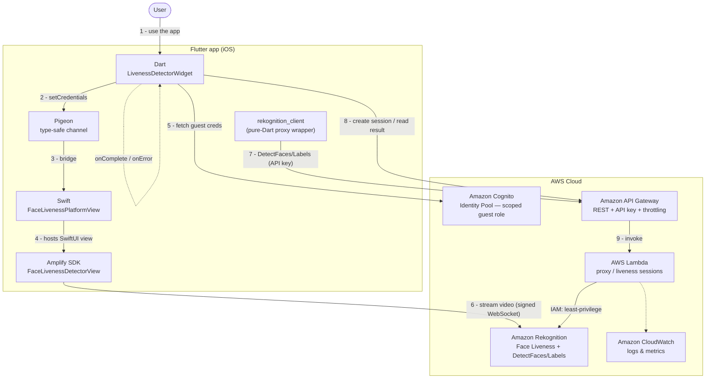

# Flutter Facial Liveness on AWS

A Flutter (iOS) demo that proves a **live person** is present using
[Amazon Rekognition Face Liveness](https://docs.aws.amazon.com/rekognition/latest/dg/face-liveness.html),
plus image analysis (face/label detection) — all without ever placing AWS
credentials in the mobile app.

It shows two patterns SAs are frequently asked about:

1. **How to structure a Flutter app + AWS wrapper** so it is testable and never
   leaks AWS credentials.
2. **How to embed a native AWS SDK view** (Amplify's `FaceLivenessDetectorView`)
   inside Flutter through a type-safe Platform View bridge.

> This is sample code for demonstration and learning. It is **not
> production-ready** and must be reviewed, tested, and hardened for your own
> security and compliance requirements before any production use.

## Architecture

Region: `us-east-1`. Two independent paths from the iOS app — a proxied image
analysis path and a native Face Liveness path.



<details>
<summary>Text version</summary>

```
Flutter app (iOS)
  ├── rekognition_client (pure-Dart wrapper)  ──► API Gateway + Lambda (proxy)  ──► Amazon Rekognition
  │                                                (least-privilege IAM role)        DetectFaces / DetectLabels
  │
  └── rekognition_liveness (native plugin)    ──► Cognito Identity (guest creds, scoped)
        Amplify FaceLivenessDetectorView       ──► streams video over signed WebSocket ──► Amazon Rekognition
                                                                                            Face Liveness
```

</details>

Two independent paths:

- **Image analysis** goes through a backend **proxy** so the app carries no AWS
  credentials. The Lambda holds a least-privilege role limited to
  `DetectFaces` / `DetectLabels`.
- **Face Liveness** uses Amplify's native view, which needs short-lived Cognito
  guest credentials scoped to only `rekognition:StartFaceLivenessSession`. The
  authoritative verdict is fetched back through the proxy.

## AWS services used

| Service | Purpose |
|---------|---------|
| Amazon Rekognition | Face/label detection and Face Liveness |
| AWS Lambda | Proxy that calls Rekognition (512 MB, arm64, Python 3.12) |
| Amazon API Gateway | REST endpoint + API key + throttling / daily quota |
| Amazon Cognito | Short-lived, scoped guest credentials for the native liveness view |
| Amazon CloudWatch | Lambda and API Gateway logs |

## Repository structure

| Path | What it is |
|------|------------|
| [`backend/cdk/`](backend/cdk/) | API Gateway + Lambda + least-privilege IAM (AWS CDK) |
| [`packages/rekognition_client/`](packages/rekognition_client/) | Pure-Dart wrapper: interface, HTTP impl, models, tests |
| [`packages/rekognition_liveness/`](packages/rekognition_liveness/) | Flutter plugin embedding the native Amplify liveness view (iOS) |
| [`app_example/`](app_example/) | Flutter app (feature-first + Riverpod) that consumes both |

## How to run

1. **Backend** — deploy the proxy and note the outputs:
   ```bash
   cd backend/cdk
   npm install
   npx cdk deploy
   ```
   Record `ApiUrl` and retrieve the API key value:
   ```bash
   aws apigateway get-api-key --api-key <ApiKeyId> --include-value --query value --output text
   ```

2. **App** — run against those values (never hardcode them; see `.env.example`):
   ```bash
   cd app_example
   flutter pub get
   flutter run \
     --dart-define=REKOGNITION_API_URL=<ApiUrl> \
     --dart-define=REKOGNITION_API_KEY=<key> \
     --dart-define=IDENTITY_POOL_ID=<region>:<uuid> \
     --dart-define=AWS_REGION=us-east-1
   ```

## Security

- The app **never** carries AWS credentials. Only the Lambda talks to
  Rekognition for image analysis, with a least-privilege role.
- The API URL and key are injected at build time via `--dart-define`, never
  committed to source.
- API key + throttling + daily quota on API Gateway limit abuse and cost.
- The native liveness path uses **short-lived Cognito guest credentials**
  scoped to a single Rekognition action.

## Cost

You are responsible for the cost of the AWS services used while running this
sample. There is no additional cost for the sample itself. See the pricing pages
for each service used. Prices are subject to change.

## Platform support

iOS only for the native Face Liveness flow. Android is documented in the plugin
but not yet wired up. Image analysis (via the proxy) is platform-agnostic.

## License

Apache-2.0. See the repository root [LICENSE](../../LICENSE).
